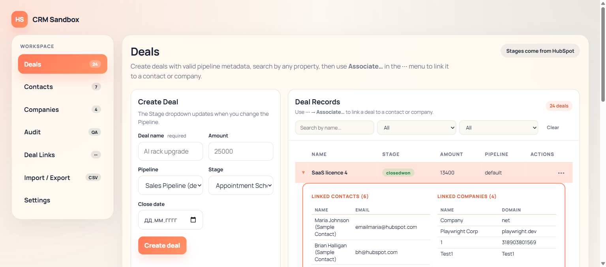
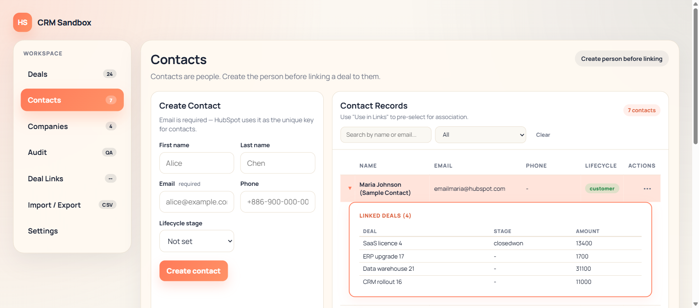
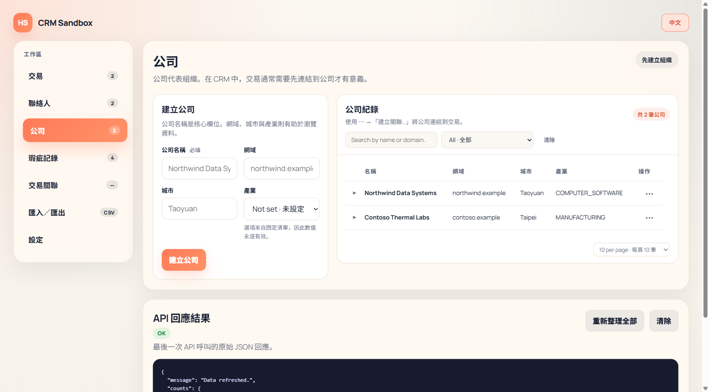

# CRM Sandbox

A portfolio project — a fully working CRM built entirely from scratch. No external service, no API key, no signup. Every record lives in a self-built, file-backed data layer.

**Not a mockup.** Create a deal here and it's really written to disk. Pick the wrong pipeline stage and the app rejects it. The UI shows exactly which field to fix.

---

## What it demonstrates

| Area | Detail |
|---|---|
| **Self-built data layer** | Deals, contacts, companies, defects — full CRUD via `LocalCrmStore`, persisted to one JSON file |
| **Associations** | Bidirectional links written both directions at once, stored alongside the records |
| **Built-in metadata** | Pipeline stages, lifecycle stages, and industry options come from code, not free text |
| **Runtime plugins** | Upload a ZIP with a `.plugin.dll` + `.js` module — a new panel appears without touching the shell |
| **CSV import/export** | Preview validation per row before anything is written |
| **Error handling** | Rejection messages parsed and mapped to the exact form field |
| **Different-domain module** | Defects (QA) — a manufacturing quality module on the same module contract, optionally cross-linked to a Company |

---

## Screenshots

| Deals panel | Contacts panel | Companies panel |
|---|---|---|
|  |  |  |

Expand any row (▶) to see linked records inline. No separate screen.

---

## Tech stack

**Backend** — C# · ASP.NET Minimal API
**Frontend** — Native ES modules · No React · No bundler
**Data layer** — `LocalCrmStore` · file-backed JSON store · zero external dependencies
**Runtime plugins** — Managed plugin loading · Host dispatcher · Shared module order

---

## Architecture

```
hubspot-crm-suite/
├── hubspot-deals-sandbox/          # Main project
│   ├── Data/                       # LocalCrmStore — the self-built data layer
│   ├── Modules/                    # Deals, Contacts, Companies, Defects — each owns its routes + service
│   ├── wwwroot/
│   │   ├── js/modules/             # Frontend modules — one file per panel
│   │   └── js/                     # Shared: state, renders, forms, pagination, inline-edit
│   └── Program.cs                  # Minimal API host + plugin loader
└── hubspot-deals-sandbox-presentation/
    ├── presentation.html           # Slide deck (self-contained HTML)
    └── screenshots/                # Panel screenshots
```

Each backend module registers its own routes and owns its service calls into `LocalCrmStore`.
Each frontend module exports `{ id, renderPanel(), renderNav(), mount() }` — the shell loads them in order.

---

## Key features

- **Inline expand rows** — click ▶ on any deal, contact, or company row to see linked records without leaving the table
- **Inline edit** — edit a record directly in the table row, no form switching
- **Pagination** — configurable page size, persists per module
- **Filters** — name, stage/lifecycle, pipeline — with active-filter indicator
- **Module ordering** — reorder panels in Settings; order persists across reloads
- **Plugin system** — drop a ZIP to install a new panel; enable/disable/delete without restart
- **Traditional Chinese by default** — every panel and the landing page load in 繁體中文; one click switches to English

---

## Running locally

```powershell
# From hubspot-deals-sandbox/
dotnet run -- web

# Opens at http://localhost:5100
```

Nothing to configure. Data is created fresh on first run and persists to `App_Data/crm-store.json` from then on.

---

## Presentation

`hubspot-deals-sandbox-presentation/presentation.html` — open in a browser.
Loads in 繁體中文 by default. Press `→` to advance, `N` for presenter notes, `F` for fullscreen, `中文` to switch to English.

PDF exports are also in that folder: `CRM-Sandbox-Presentation.pdf` and `CRM-Sandbox-Portfolio-Taiwan.pdf`.
