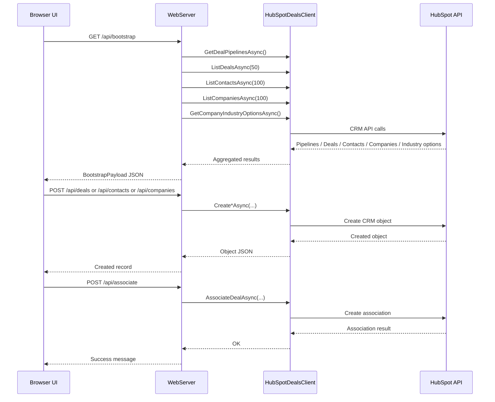

# Site API Schema

This file lists the API endpoints that are actually used by the current website UI in `wwwroot/index.html`.

## High-Level Flow

```mermaid
flowchart TD
    UI[Browser UI<br/>index.html]

    UI -->|GET /api/bootstrap| BOOT[Bootstrap API]
    BOOT --> HP1[HubSpot: Deal Pipelines]
    BOOT --> HP2[HubSpot: Deals]
    BOOT --> HP3[HubSpot: Contacts]
    BOOT --> HP4[HubSpot: Companies]
    BOOT --> HP5[HubSpot: Company Industry Options]

    UI -->|POST /api/deals| DEAL_CREATE[Create Deal]
    UI -->|POST /api/deals/search| DEAL_SEARCH[Search Deals]
    UI -->|POST /api/contacts| CONTACT_CREATE[Create Contact]
    UI -->|POST /api/companies| COMPANY_CREATE[Create Company]

    UI -->|POST /api/associate| ASSOC_CREATE[Create Association]
    UI -->|GET /api/associations/{dealId}/{objectType}| ASSOC_READ[Read Associations]

    UI -->|Import Apply<br/>POST /api/{objectType}| IMPORT_APPLY[Create rows from CSV]
    IMPORT_APPLY --> DEAL_CREATE
    IMPORT_APPLY --> CONTACT_CREATE
    IMPORT_APPLY --> COMPANY_CREATE
```

## Frontend-to-Backend Endpoint Map

| Frontend feature | Method | Route | Request schema | Response schema | Notes |
|---|---|---|---|---|---|
| Initial page load / refresh | `GET` | `/api/bootstrap` | none | `{ pipelines, deals, contacts, companies, companyIndustryOptions }` | Main startup payload. The UI uses this instead of calling multiple list endpoints separately. |
| Create deal | `POST` | `/api/deals` | `{ dealname?, amount?, pipeline?, dealstage?, closedate? }` | `HubSpotDealRecord` | Called from `createDeal()`. |
| Search deals | `POST` | `/api/deals/search` | `{ property, operator, value }` | `HubSpotDealRecord[]` | Called from `searchDeals()`. |
| Create contact | `POST` | `/api/contacts` | `{ firstname?, lastname?, email?, phone?, lifecyclestage? }` | `HubSpotCrmRecord` | Called from `createContact()`. |
| Create company | `POST` | `/api/companies` | `{ name?, domain?, city?, industry? }` | `HubSpotCrmRecord` | Called from `createCompany()`. |
| Create deal/company/contact association | `POST` | `/api/associate` | `{ dealId, objectType, objectId }` | `{ message }` | Called from `associateSelected()`. `objectType` is currently `contacts` or `companies`. |
| Read association list | `GET` | `/api/associations/{dealId}/{objectType}` | route params: `dealId`, `objectType` | `HubSpotAssociationRecord[]` | Called from `loadAssociations()`. |
| Import apply: deals | `POST` | `/api/deals` | one CSV row mapped to deal fields | `HubSpotDealRecord` | Used inside `applyImport()` when `objectType === "deals"`. |
| Import apply: contacts | `POST` | `/api/contacts` | one CSV row mapped to contact fields | `HubSpotCrmRecord` | Used inside `applyImport()` when `objectType === "contacts"`. |
| Import apply: companies | `POST` | `/api/companies` | one CSV row mapped to company fields | `HubSpotCrmRecord` | Used inside `applyImport()` when `objectType === "companies"`. |

## Runtime Sequence



## Important Note About Import / Export

The current website does **not** use the server-side endpoints below during normal UI flow:

- `GET /api/export/{objectType}`
- `GET /api/export/{objectType}/template`
- `POST /api/import/{objectType}/preview`
- `POST /api/import/{objectType}/apply`

Instead, the current `index.html` does this:

1. **Export** is generated directly in the browser from already loaded `state.deals`, `state.contacts`, and `state.companies`.
2. **Import preview** is validated directly in the browser.
3. **Import apply** sends each ready row to:
   - `POST /api/deals`
   - `POST /api/contacts`
   - `POST /api/companies`

So these endpoints exist on the backend, but they are **not currently used by the site UI**.

## UI Function to API Reference

| UI function in `index.html` | API used |
|---|---|
| `refreshAll()` | `GET /api/bootstrap` |
| `createDeal()` | `POST /api/deals` |
| `searchDeals()` | `POST /api/deals/search` |
| `createContact()` | `POST /api/contacts` |
| `createCompany()` | `POST /api/companies` |
| `associateSelected()` | `POST /api/associate` |
| `loadAssociations()` | `GET /api/associations/{dealId}/{objectType}` |
| `applyImport()` | `POST /api/deals`, `POST /api/contacts`, `POST /api/companies` |

## Backend Endpoints Defined but Not Used Directly by This UI

These routes exist in `WebServer.cs`, but the current website does not call them directly:

- `GET /api/deals`
- `GET /api/contacts`
- `GET /api/companies`
- `GET /api/pipelines`
- `GET /api/export/{objectType}`
- `GET /api/export/{objectType}/template`
- `POST /api/import/{objectType}/preview`
- `POST /api/import/{objectType}/apply`
- Legacy aliases:
  - `GET /api/list`
  - `POST /api/search`
  - `POST /api/create`
